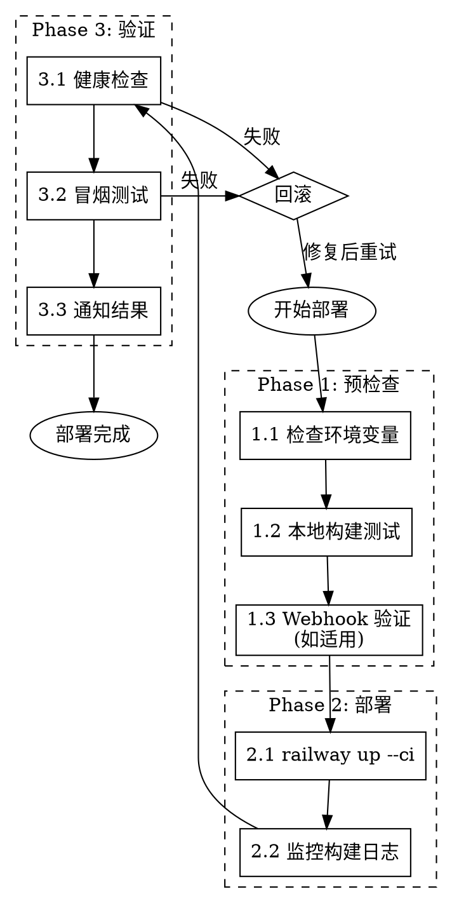

# Railway Deploy Workflow 完整部署工作流

## Overview

编排完整的 Railway 部署流程，包括预检查、部署和验证。

**核心原则:** 部署前检查，部署后验证，不要盲目 `railway up`。

## When to Use

- 部署到生产环境前需要完整检查
- 项目包含 webhook 需要验证
- 之前部署失败过，需要系统性检查
- 首次部署新服务

**不要使用当:**
- 只是快速 `railway up`（直接用 `railway:deploy`）
- 只需要查看部署状态（用 `railway:service`）

## 完整部署流程



## Phase 1: 预检查

### 1.1 检查环境变量

**调用 `railway:environment` 检查必需变量：**

```bash
# 查看当前环境变量
railway variables

# 检查必需变量是否存在
railway variables | grep -E "DATABASE_URL|API_KEY|WEBHOOK_SECRET" || echo "⚠️ 缺少必需变量"
```

**必需变量清单（根据项目调整）：**

| 变量 | 用途 | 必需 |
|------|------|------|
| `DATABASE_URL` | 数据库连接 | ✅ |
| `FEISHU_APP_ID` | 飞书应用 | 如用飞书 |
| `FEISHU_APP_SECRET` | 飞书密钥 | 如用飞书 |
| `WEBHOOK_SECRET` | Webhook 验证 | 如有 webhook |

**设置缺失变量：**
```bash
railway variables set KEY=value
```

### 1.2 本地构建测试

```bash
# Node.js 项目
npm run build && echo "✅ 构建成功" || echo "❌ 构建失败"

# TypeScript 类型检查
npx tsc --noEmit && echo "✅ 类型检查通过" || echo "❌ 类型错误"

# Python 项目
python -m py_compile main.py && echo "✅ 语法检查通过"
```

### 1.3 Webhook 验证（如适用）

**如果项目包含 webhook，调用 `webhook-debugger`：**

```bash
# 启动本地服务器
npm run dev &
SERVER_PID=$!
sleep 3

# 测试 webhook challenge
curl -X POST http://localhost:3000/webhook/feishu \
  -H "Content-Type: application/json" \
  -d '{"challenge":"test","token":"test","type":"url_verification"}'

# 期望输出: {"challenge":"test"}

kill $SERVER_PID
```

**或使用测试脚本：**
```bash
~/.claude/skills/webhook-debugger/scripts/test-webhook.sh http://localhost:3000/webhook/feishu 3
```

## Phase 2: 部署

### 2.1 执行部署

**调用 `railway:deploy`：**

```bash
# CI 模式 - 流式输出日志（推荐用于需要监控的部署）
railway up --ci

# 或 Detach 模式 - 后台部署
railway up --detach
```

### 2.2 监控构建日志

**CI 模式会自动流式输出日志。如果用 detach 模式：**

```bash
# 查看最近部署状态
railway status

# 查看构建日志（指定行数，避免无限流）
railway logs --build --lines 100
```

**常见构建失败：**

| 错误 | 原因 | 修复 |
|------|------|------|
| `npm ERR! missing script: build` | 缺少构建脚本 | 添加 `"build"` 到 package.json |
| `ModuleNotFoundError` | 缺少依赖 | 检查 requirements.txt/package.json |
| `tsc: command not found` | 缺少 TypeScript | 添加到 devDependencies |
| `ENOMEM` | 内存不足 | Railway 升级 plan 或优化构建 |

## Phase 3: 验证

### 3.1 健康检查

```bash
# 获取部署 URL
DEPLOY_URL=$(railway status --json | jq -r '.deploymentDomain')

# 健康检查
curl -s "https://$DEPLOY_URL/health" && echo "✅ 健康检查通过"

# 或检查 HTTP 状态
HTTP_CODE=$(curl -s -o /dev/null -w "%{http_code}" "https://$DEPLOY_URL/")
if [ "$HTTP_CODE" = "200" ]; then
    echo "✅ 服务正常响应 (HTTP $HTTP_CODE)"
else
    echo "❌ 服务异常 (HTTP $HTTP_CODE)"
fi
```

### 3.2 冒烟测试

```bash
# 测试关键端点
curl -s "https://$DEPLOY_URL/api/status" | jq .

# 测试 webhook endpoint（生产环境）
curl -X POST "https://$DEPLOY_URL/webhook/feishu" \
  -H "Content-Type: application/json" \
  -d '{"challenge":"prod_test","token":"test","type":"url_verification"}'
```

### 3.3 通知结果（可选）

**使用 `lark-webhook-sender` 发送部署通知：**

```bash
python3 ~/.claude/skills/lark-webhook-sender/scripts/send_message.py \
  --webhook "YOUR_WEBHOOK_URL" \
  --title "🚀 部署完成" \
  --content "服务: $SERVICE_NAME\n环境: production\n状态: 成功" \
  --card
```

## 快速检查清单

执行部署前，确认以下项目：

```
□ 环境变量已配置完整
□ 本地构建通过
□ TypeScript 类型检查通过
□ Webhook challenge 验证通过（如适用）
□ 已 commit 所有更改
□ 在正确的 branch
```

## 回滚策略

**如果部署后验证失败：**

```bash
# 查看最近部署
railway deployments

# 回滚到上一个部署（手动触发 redeploy）
railway redeploy --deployment <previous-deployment-id>
```

## 与其他 Skills 的关系

| Skill | 用途 | 何时调用 |
|-------|------|---------|
| `railway:environment` | 环境变量管理 | Phase 1.1 |
| `railway:deploy` | 执行部署命令 | Phase 2.1 |
| `railway:service` | 查看服务状态 | Phase 3.1 |
| `railway:deployment` | 查看部署日志 | Phase 2.2 |
| `webhook-debugger` | Webhook 验证 | Phase 1.3 |
| `lark-webhook-sender` | 发送通知 | Phase 3.3 |

## 一键部署脚本

将以下脚本保存为 `deploy.sh`：

```bash
#!/bin/bash
set -e

echo "=== Railway 完整部署工作流 ==="

# Phase 1: 预检查
echo -e "\n[Phase 1] 预检查..."

echo "1.1 检查环境变量..."
railway variables > /dev/null || { echo "❌ 无法获取环境变量"; exit 1; }
echo "✅ 环境变量已配置"

echo "1.2 本地构建测试..."
npm run build || { echo "❌ 构建失败"; exit 1; }
echo "✅ 构建成功"

echo "1.3 类型检查..."
npx tsc --noEmit || { echo "❌ 类型错误"; exit 1; }
echo "✅ 类型检查通过"

# Phase 2: 部署
echo -e "\n[Phase 2] 部署..."
railway up --ci || { echo "❌ 部署失败"; exit 1; }
echo "✅ 部署完成"

# Phase 3: 验证
echo -e "\n[Phase 3] 验证..."
sleep 10  # 等待服务启动

DEPLOY_URL=$(railway status --json 2>/dev/null | jq -r '.deploymentDomain' || echo "")
if [ -n "$DEPLOY_URL" ]; then
    HTTP_CODE=$(curl -s -o /dev/null -w "%{http_code}" "https://$DEPLOY_URL/" --max-time 10)
    if [ "$HTTP_CODE" = "200" ]; then
        echo "✅ 健康检查通过 (HTTP $HTTP_CODE)"
    else
        echo "⚠️ 健康检查返回 HTTP $HTTP_CODE"
    fi
else
    echo "⚠️ 无法获取部署 URL，请手动验证"
fi

echo -e "\n=== 部署完成 ==="
```

## 常见问题

| 问题 | 症状 | 解决方案 |
|------|------|---------|
| 环境变量未生效 | 运行时读取失败 | 确认变量名无拼写错误，重新部署 |
| 构建成功但启动失败 | Deployment crashed | 检查启动命令和端口配置 |
| Webhook 本地通过生产失败 | Challenge 返回错误 | 检查路由路径是否一致 |
| 健康检查超时 | 服务未响应 | 检查 PORT 环境变量和监听地址 |

<!-- 最后验证: 2026-02-05 - 文档与 scripts/deploy.sh 实现一致 -->
