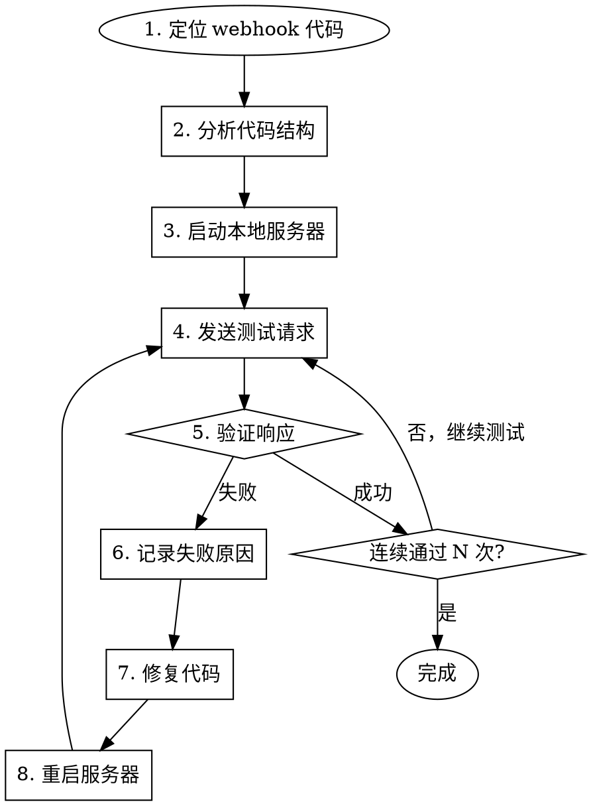

# Webhook Debugger 自主调试器

## Overview

自主调试和修复 webhook 集成，通过自动化测试循环验证 challenge 响应格式。

**核心原则:** 不要猜测，用真实请求验证。迭代直到连续通过 N 次测试。

## When to Use

- Webhook challenge 验证失败
- 飞书/Lark/Slack webhook 返回格式错误
- 部署后 webhook 无法正常工作
- 需要在本地模拟 webhook 验证流程

**不要使用当:**
- 只是发送 webhook 消息（使用 `lark-webhook-sender`）
- 需要飞书 API 知识（使用 `feishu-developer`）

## 自主调试流程



## Phase 1: 定位和分析代码

**必须先阅读代码再进行任何操作:**

```bash
# 查找 webhook 相关文件
find ~/Projects ~/dev -name "*.ts" -o -name "*.js" | xargs grep -l "webhook\|challenge" 2>/dev/null | head -20

# 或使用 Glob
# 模式: **/webhook*.ts, **/routes/*.ts, **/api/*.ts
```

**分析要点:**
1. Challenge 处理逻辑在哪里？
2. 响应格式是否正确？
3. HTTP 状态码是否正确？
4. Content-Type 是否正确？

## Phase 2: 飞书 Challenge 验证规范

**飞书发送的 challenge 请求:**
```json
{
  "challenge": "random_string_abc123",
  "token": "verification_token",
  "type": "url_verification"
}
```

**必须返回的响应格式:**
```json
{
  "challenge": "random_string_abc123"
}
```

**关键要求:**
- HTTP 状态码: `200`
- Content-Type: `application/json`
- 响应体必须是 JSON 对象，只包含 `challenge` 字段
- `challenge` 值必须与请求中的完全一致

## Phase 3: 本地测试服务器

**启动服务器 (根据项目类型):**

```bash
# Node.js/TypeScript
cd /path/to/project && npm run dev

# Python
cd /path/to/project && python app.py

# 或使用 ts-node
npx ts-node src/server.ts
```

**确认服务器运行:**
```bash
curl -s http://localhost:3000/health || echo "服务器未响应"
```

## Phase 4: 模拟 Challenge 请求

**标准测试命令:**

```bash
# 飞书 challenge 验证测试
curl -X POST http://localhost:3000/webhook/feishu \
  -H "Content-Type: application/json" \
  -d '{
    "challenge": "test_challenge_001",
    "token": "test_token",
    "type": "url_verification"
  }' \
  -w "\n\nHTTP Status: %{http_code}\nContent-Type: %{content_type}\n"
```

**期望输出:**
```
{"challenge":"test_challenge_001"}

HTTP Status: 200
Content-Type: application/json
```

## Phase 5: 自动化测试脚本

将此脚本保存并运行以进行连续测试:

```bash
#!/bin/bash
# webhook-test.sh - 连续测试 webhook challenge 验证

ENDPOINT="${1:-http://localhost:3000/webhook/feishu}"
PASS_COUNT=0
REQUIRED_PASSES=5
ITERATION=0
LOG_FILE="webhook-debug-$(date +%Y%m%d_%H%M%S).log"

echo "=== Webhook 调试日志 ===" > "$LOG_FILE"
echo "端点: $ENDPOINT" >> "$LOG_FILE"
echo "开始时间: $(date)" >> "$LOG_FILE"
echo "---" >> "$LOG_FILE"

while [ $PASS_COUNT -lt $REQUIRED_PASSES ]; do
    ITERATION=$((ITERATION + 1))
    CHALLENGE="test_challenge_$(date +%s)_$ITERATION"

    echo -e "\n[迭代 $ITERATION] 测试 challenge: $CHALLENGE"
    echo -e "\n[迭代 $ITERATION] $(date)" >> "$LOG_FILE"

    RESPONSE=$(curl -s -X POST "$ENDPOINT" \
      -H "Content-Type: application/json" \
      -d "{\"challenge\": \"$CHALLENGE\", \"token\": \"test\", \"type\": \"url_verification\"}" \
      -w "\n%{http_code}")

    HTTP_CODE=$(echo "$RESPONSE" | tail -1)
    BODY=$(echo "$RESPONSE" | head -n -1)
    EXPECTED="{\"challenge\":\"$CHALLENGE\"}"

    echo "响应: $BODY (HTTP $HTTP_CODE)" >> "$LOG_FILE"

    if [ "$HTTP_CODE" = "200" ] && [ "$BODY" = "$EXPECTED" ]; then
        PASS_COUNT=$((PASS_COUNT + 1))
        echo "✅ 通过 ($PASS_COUNT/$REQUIRED_PASSES)"
        echo "结果: 通过 ($PASS_COUNT/$REQUIRED_PASSES)" >> "$LOG_FILE"
    else
        echo "❌ 失败"
        echo "  期望: $EXPECTED"
        echo "  实际: $BODY (HTTP $HTTP_CODE)"
        echo "结果: 失败" >> "$LOG_FILE"
        echo "期望: $EXPECTED" >> "$LOG_FILE"
        echo "实际: $BODY" >> "$LOG_FILE"
        PASS_COUNT=0  # 重置计数

        echo -e "\n⚠️ 需要修复代码后重新运行测试"
        exit 1
    fi

    sleep 0.5
done

echo -e "\n🎉 连续通过 $REQUIRED_PASSES 次测试！"
echo -e "\n=== 测试完成: 成功 ===" >> "$LOG_FILE"
echo "日志保存至: $LOG_FILE"
```

## Phase 6: 常见问题和修复

| 问题 | 症状 | 修复 |
|------|------|------|
| **响应格式错误** | 返回 `{"challenge":"xxx","code":0}` | 只返回 `{"challenge":"xxx"}` |
| **状态码错误** | 返回 404 或 500 | 检查路由配置 |
| **Content-Type 错误** | 返回 text/html | 设置 `res.json()` 或正确的 header |
| **Challenge 值不匹配** | 返回不同的 challenge | 直接返回 `req.body.challenge` |
| **未处理 POST** | 返回 405 | 添加 POST 路由处理 |
| **路径不匹配** | 返回 404 | 检查 URL 路径一致性 |

### 典型修复代码

**Node.js/Express:**
```typescript
// ❌ 错误
app.post('/webhook', (req, res) => {
  if (req.body.type === 'url_verification') {
    res.send({ challenge: req.body.challenge, status: 'ok' });
  }
});

// ✅ 正确
app.post('/webhook', (req, res) => {
  if (req.body.type === 'url_verification') {
    res.json({ challenge: req.body.challenge });
    return;
  }
  // 处理其他事件...
});
```

**Python/Flask:**
```python
# ❌ 错误
@app.route('/webhook', methods=['POST'])
def webhook():
    data = request.json
    if data.get('type') == 'url_verification':
        return jsonify(challenge=data['challenge'], success=True)

# ✅ 正确
@app.route('/webhook', methods=['POST'])
def webhook():
    data = request.json
    if data.get('type') == 'url_verification':
        return jsonify({'challenge': data['challenge']})
    # 处理其他事件...
```

## Phase 7: 调试日志格式

每次调试迭代必须记录:

```
=== Webhook 调试日志 ===
项目: [项目名称]
端点: [完整 URL]
开始时间: [时间戳]
---

[迭代 1] 2024-01-15 10:30:00
请求:
  POST /webhook/feishu
  Body: {"challenge":"test_001","type":"url_verification"}
响应:
  HTTP 200
  Body: {"challenge":"test_001","code":0}
结果: 失败
原因: 响应包含额外字段 "code"
修复: 移除响应中的 code 字段

[迭代 2] 2024-01-15 10:32:00
请求: ...
响应:
  HTTP 200
  Body: {"challenge":"test_001"}
结果: 通过 (1/5)

...

=== 测试完成: 连续通过 5 次 ===
总迭代: 6
失败原因汇总:
  1. 响应包含额外字段
修复措施汇总:
  1. 简化响应为仅包含 challenge
```

## 自主执行检查清单

执行调试时，按顺序完成:

- [ ] 1. 定位项目中的 webhook 处理代码
- [ ] 2. 阅读并理解现有实现
- [ ] 3. 识别潜在问题点
- [ ] 4. 启动本地服务器
- [ ] 5. 发送第一个测试请求
- [ ] 6. 分析响应，对比期望格式
- [ ] 7. 如果失败：记录原因 → 修复代码 → 重启服务器 → 重新测试
- [ ] 8. 重复直到连续通过 5 次
- [ ] 9. 保存调试日志
- [ ] 10. 提交修复到版本控制

## 与其他 Skills 的关系

- **feishu-developer**: 提供飞书 API 和事件订阅的完整知识
- **lark-webhook-sender**: 用于发送 webhook 消息
- **systematic-debugging**: 通用调试方法论
- **test-driven-development**: 创建自动化测试用例

## Real-World Impact

- 自主调试通常在 3-5 次迭代内完成
- 连续通过 5 次测试确保稳定性
- 调试日志便于回顾和知识积累
- 避免部署后才发现验证失败

<!-- 最后验证: 2026-02-05 - 文档与 scripts/test-webhook.sh 实现一致 -->
